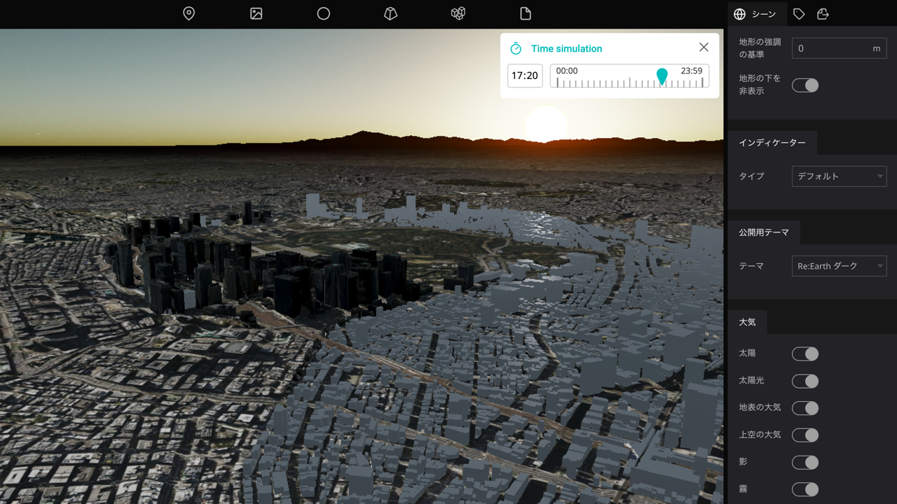
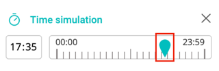
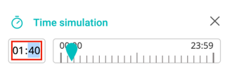

# Time Simulator Plugin

## このプラグインについて

-  現在時刻に任意時刻を設定するプラグインです。
 　
### 操作方法

- タイムスライダーの「つまみ」を掴んでスライドし時刻を変更します。

  

- 時刻表時部分に直接数字を入力して時刻を変更することも可能です。

  

## 備考
- テストブラウザ環境
  - OS:Mac OS Sonoma 14.2.1
  - ブラウザ：Google Chrome 121.0.6167.139

## 開発者欄

このプラグインは、Re:Earth公式プラグインです。

 

ソースコードはこちら(https://github.com/eukarya-inc/reearth-plugin-time-simulator)

- コミュニティ

  - このプラグインを利用したプロジェクトをユーザーコミュニティでシェアしましょう。

  - このプラグインについての不明点がある場合にもここからRe:Earthチームや他の開発者に質問することができます。

  - Discordへのリンクはこちら(https://discord.gg/BXcQhvwqqM)
